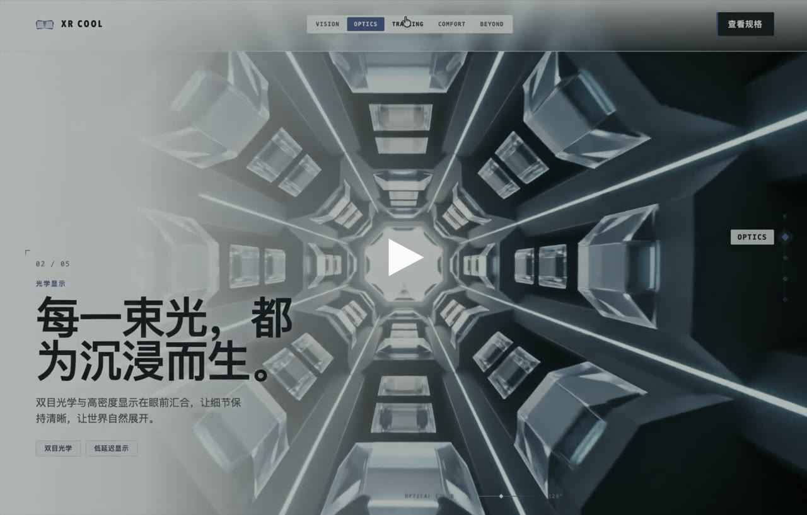

# Scroll World v5

> 用火山方舟**豆包**或 **Higgsfield** 制作滚动驱动的预渲染 3D 电影网站、low-poly/clay diorama 品牌落地页和 Apple 式 scroll-scrub cinematic website。
>
> *A resumable pipeline that turns scroll progress into pre-rendered video time — one skill, two providers (Doubao / Higgsfield), portable double-click delivery.*

滚动进度被映射为已编码视频的时间轴：**供应商**负责一致场景与连续镜头，**页面**负责稳定 seek、文案、无障碍和回退。整条流水线以项目内 `world.json` 为单一事实源，以 `.work/usage-ledger.json` 为生成与成本账本，产物可**直接双击打开**、也可原样上传到任意静态服务器。

---

## 🎬 演示 / Demo

**▶ [在线预览示例站](https://vr-jobs.github.io/scroll-world/example/xr-cool-vr/)** ｜ 点击封面播放滚动演示视频（1080p，有声）：

[](https://vr-jobs.github.io/scroll-world/docs/demo.mp4)

> 由本 skill 生成的 **XR COOL** 示例站（源码见 [`example/xr-cool-vr/`](example/xr-cool-vr/)）。「在线预览」可直接点开体验，无需 clone。

---

## ✨ 特性

- **双供应商**：火山方舟豆包（Seedream / Seedance）或 Higgsfield，一套项目锁定一个 provider。
- **两种模式**：`detailed` 详细版（首图 → 整批图 → preview → final 逐级审批）与 `fast` 快速版（仅方案批准，直出 1080p）。
- **可恢复状态机**：异步视频、人工门禁都能中断后 `--resume`，不重复扣费。
- **依赖感知返工**：只重做被影响的场景与下游视频，历史请求不删。
- **三重 QA**：媒体（H.264/SSIM/黑帧/运动能量）+ 语义（逐场 must_include/must_not_include）+ 浏览器（`file://` 与 HTTP × desktop/mobile/tablet）。
- **可移植交付**：`dist/index.html` 双击即用，无 localhost、无根路径、无 Service Worker。
- **成本透明**：图片/视频/credits 分别记账，缺价格时如实标「不可得」，绝不硬编码单价。

---

## 🧩 安装

三种 AI 编码工具（Claude Code / OpenAI Codex / 腾讯 CodeBuddy）**使用完全相同的 skill 格式**（一个含 `SKILL.md` 的目录），只是技能目录不同。安装 = 把本仓库 clone 进对应目录。

### 前置依赖

| 依赖 | 用途 | 是否必需 |
|---|---|---|
| `python3` (3.8+) | 编排/验证/构建（仅标准库，无需 pip 安装） | ✅ |
| `curl` `jq` | 调用生成 API、解析响应 | ✅ |
| `ffmpeg` `ffprobe` | 编码、抽尾帧、媒体 QA | ✅ |
| `higgsfield` CLI | 仅 Higgsfield 路线需要 | ⬜ 可选 |

### Claude Code

```bash
git clone https://github.com/VR-Jobs/scroll-world.git ~/.claude/skills/scroll-world
```

重启 Claude Code 或开新会话，技能列表即出现 `scroll-world`。仅当前项目可用则改 clone 到 `<项目>/.claude/skills/scroll-world`。

### OpenAI Codex

```bash
git clone https://github.com/VR-Jobs/scroll-world.git ~/.codex/skills/scroll-world
```

Codex 会读取同一个 `SKILL.md` 与 `agents/openai.yaml` 接口清单。项目级则用 `<项目>/.codex/skills/`。

### 腾讯 CodeBuddy

先装 CLI，再 clone 技能：

```bash
npm install -g @tencent-ai/codebuddy-code
git clone https://github.com/VR-Jobs/scroll-world.git ~/.codebuddy/skills/scroll-world
```

用户级放 `~/.codebuddy/skills/`，项目级放 `<项目>/.codebuddy/skills/`。CodeBuddy 自动发现并可由 AI 自动触发，或手动 `/scroll-world` 调用。

### 验证安装

```bash
SW=~/.claude/skills/scroll-world        # ← 按你装的平台改成 .codex / .codebuddy
python3 "$SW/scripts/scroll-world.py" --help     # 应列出子命令
python3 "$SW/scripts/scroll-world.py" themes      # 应输出 6 个主题
```

> ℹ️ 技能文档里的示例把 `SW` 写成了作者的绝对路径。**跟着命令操作前，先把 `SW` 设成你自己的安装目录**（如上），脚本本身用相对定位，换任何机器/目录都能跑。

---

## 🎬 两大供应商

一个项目在 `init` 时锁定一个 provider，之后不混用。首次需在终端配置一次（密钥/凭证只存用户级、权限 `0600`，**绝不进项目或提交**）。

### 豆包（火山方舟 Volcengine Ark）

| 阶段 | 模型 | 说明 |
|---|---|---|
| 图片 | **Seedream 5.0 Pro** (`doubao-seedream-5-0-pro-260628`) | 文生图 + 最多 10 张参考图，默认 2K / 16:9 或 9:16 |
| 视频 | **Seedance 2.0** Full / Fast / Mini | 首帧/首尾帧/多模态参考、返回尾帧，480p–4K，4–15s，输出 MP4 |

- 认证：在火山方舟控制台创建 `ARK_API_KEY`，**隐藏终端粘贴一次**：
  ```bash
  python3 "$SW/scripts/provider_config.py" configure --provider doubao
  ```
- 生成结果 URL 为**临时有效**（约 24h），成功后立即下载本地。
- 4K 是 HEVC 10-bit，网页交付会转 H.264/yuv420p 保证兼容。
- 详见 [`references/doubao-capabilities.md`](references/doubao-capabilities.md)。

### Higgsfield

| 阶段 | 模型 | 说明 |
|---|---|---|
| 图片 | `nano_banana_2` | 2K，项目比例，多 `--image` 参考 |
| 预演 | `seedance_2_0_mini` | 720p，首/尾/参考帧 |
| 成片 | `seedance_2_0` | 1080p，`mode=std`，首/尾/参考帧 |

- 认证：官方 CLI **浏览器 OAuth，不用粘贴 API Key**：
  ```bash
  curl -fsSL https://raw.githubusercontent.com/higgsfield-ai/cli/main/install.sh | sh -s -- --prefix="$HOME/.local"
  higgsfield auth login
  higgsfield workspace set <workspace_id>     # 计费 workspace 由你选，工具不代选
  python3 "$SW/scripts/provider_config.py" configure --provider higgsfield
  ```
- 按平台 **credits** 计费；`run`/`doctor` 会先做实时 model catalog/schema 预检再预留预算，schema 变动即停下询问，不静默切供应商。
- 详见 [`references/higgsfield.md`](references/higgsfield.md)。

### 怎么选

| | 豆包 | Higgsfield |
|---|---|---|
| 认证 | API Key（控制台创建） | 浏览器 OAuth（官方 CLI） |
| 计费 | 按官方计费页（图/视频） | 平台 credits |
| 额外依赖 | 无 | `higgsfield` CLI |
| 适合 | 已有火山方舟账号、需要 4K | 已有 Higgsfield 订阅、用官方多模型目录 |

---

## 🚀 使用与操作

对 AI 助手说「用 scroll-world 做一个 XXX 品牌的滚动 3D 电影网站」即可触发；它会按下面的流程走。你也可以手动执行命令。**下文均已设好 `SW`、`WORLD`、`SITE_ROOT`。**

### 快速开始（最短路径）

```bash
SW=~/.claude/skills/scroll-world

# 1) 首次：配置供应商（只需一次）
python3 "$SW/scripts/scroll-world.py" setup --status
python3 "$SW/scripts/provider_config.py" configure --provider doubao   # 或 higgsfield

# 2) 为每个网站新建独立项目目录
PROVIDER=$(python3 "$SW/scripts/provider_config.py" show-provider)
python3 "$SW/scripts/init-project.py" --workspace-root /abs/workspace \
  --name MANIFEST --slug manifest --provider "$PROVIDER" --mode detailed --theme low-poly-clay
WORLD=/abs/workspace/manifest/world.json

# 3) 填好 world.json 后，付费前三连检查
python3 "$SW/scripts/sw_tool.py" validate --world "$WORLD"
python3 "$SW/scripts/scroll-world.py" doctor --world "$WORLD"
python3 "$SW/scripts/scroll-world.py" plan   --world "$WORLD"   # 取得一次方案批准

# 4) 跑可恢复状态机
python3 "$SW/scripts/scroll-world.py" run    --world "$WORLD" --dry-run
python3 "$SW/scripts/scroll-world.py" run    --world "$WORLD" --resume
python3 "$SW/scripts/scroll-world.py" status --world "$WORLD"
```

> **退出码**：`10` = 异步视频仍在跑，稍后 `--resume`；`20` = 到达人工门禁，审批后继续。这两种都**不要**重复提交任务。

### 详细版 vs 快速版

| 模式 | 中间审批 | 视频链 | 适用 |
|---|---|---|---|
| `detailed`（推荐） | 首图 → 整批图 → mini 预演 → 逐场语义 QA | 720p 预演 → 独立 1080p 成片 | 正式品牌站、返工昂贵 |
| `fast` | 仅方案批准，中途不停 | 跳过预演，直出 1080p | 快速原型、方向已定 |

### 详细版顺序与门禁

1. **首图** → 展示风格/配色/材质/构图/产品准确性 → 批准 `anchor`
2. **余图** → 逐张展示，只重做点名图 → 批准 `images`（之后才进视频）
3. **preview 链** → 检查旅程与运镜 → 批准 `preview`
4. **final 链** → 每段都用上一段的真实尾帧续接
5. **编码 → 媒体/语义/浏览器 QA → 生产构建 → 成本报告**

```bash
python3 "$SW/scripts/scroll-world.py" approve anchor  --world "$WORLD" --note "风格批准"
python3 "$SW/scripts/scroll-world.py" approve images  --world "$WORLD" --note "整批批准"
python3 "$SW/scripts/scroll-world.py" approve preview --world "$WORLD" --note "运镜批准"
```

### 依赖感知返工

```bash
# 先看影响范围，再决定是否重做
python3 "$SW/scripts/scroll-world.py" retry --world "$WORLD" --stage still --id optics --explain
python3 "$SW/scripts/scroll-world.py" retry --world "$WORLD" --stage still --id optics
```

只失效目标资产及其下游（依赖其真实尾帧的视频），并归档相应编码/海报/QA/旧 `dist`/成本报告；账本历史请求不删。

### 交付与成本

```bash
python3 "$SW/scripts/build-production.py" --world "$WORLD" --dry-run
python3 "$SW/scripts/build-production.py" --world "$WORLD"

python3 "$SW/scripts/sw_tool.py" report --world "$WORLD" \
  --ledger "$(dirname "$WORLD")/.work/usage-ledger.json" \
  --json-output "$(dirname "$WORLD")/.work/cost-report.json" \
  --markdown-output "$(dirname "$WORLD")/COSTS.md"
```

最终 `dist/` 整个目录可双击打开或原样上传静态服务器。成本报告分别列 actual / estimated / 来源；Higgsfield credits 仅在你提供带日期换算率时才折算金额。

---

## 🎨 主题

`scroll-world.py themes` 查看全部；`init` 时 `--theme <id>`，之后按品牌改，不在生成后静默换。

| ID | 视觉方向 | 推荐场景 |
|---|---|---|
| `low-poly-clay` | 柔和微缩 clay | 产品叙事、亲和科技 |
| `chrome-futurism` | 铬金属、深蓝反射 | 硬件、汽车、未来品牌 |
| `editorial-brutalism` | 大字、硬裁切、平面 | 文化节、媒体、时尚 |
| `glass-laboratory` | 透明光学、白实验室 | 医疗、镜片、科研 |
| `cosmic-ritual` | 黑曜石、蓝符号、宇宙雾 | 艺术、音乐、文化活动 |
| `architectural-white` | 白色建筑、博物馆尺度 | 高端产品、地产、设计 |

> 关键品牌名、数字、CTA、法律信息用 HTML/CSS/SVG/预制 GLB 叠加，**不让图片或视频模型承担精确拼写**。

---

## 📁 目录结构

```
scroll-world/
├── SKILL.md                # 技能入口（frontmatter + 操作总纲）
├── README.md               # 本文件：安装 + 供应商 + 使用说明
├── LICENSE                 # MIT
├── agents/openai.yaml      # Codex 接口清单（Claude Code/CodeBuddy 忽略）
├── scripts/                # 编排 / 供应商适配 / QA / 构建（纯 Python 标准库）
│   ├── scroll-world.py     #   主状态机：setup/init/themes/doctor/plan/run/approve/retry/status
│   ├── sw_tool.py          #   validate / report
│   ├── init-project.py     #   隔离项目脚手架
│   ├── provider_config.py  #   一次性供应商配置（密钥不进项目）
│   ├── media-pipeline.py   #   编码 + 媒体 QA
│   ├── build-production.py #   可移植 dist 构建
│   └── providers/          #   doubao / higgsfield 适配器
├── references/             # 按需读取：pipeline / 供应商能力 / prompts / themes / quality / gotchas
├── assets/                 # 主题目录 + world.example.json
├── evals/  tests/          # 触发用例 + 单元测试
├── docs/                   # README 媒体（demo.mp4 + 海报）
└── example/                # 可直接测试的成品示例
    └── xr-cool-vr/         #   XR COOL 滚动 3D 落地页（双击 index.html 即测）
```

---

## 🔒 设计原则

- **密钥零泄露**：API Key / OAuth 凭证 / `.work` / 用户配置绝不进项目交付或提交（本仓库已 `.gitignore` 排除）。
- **价格不硬编码**：单价随官方页变化，缺失就标「不可得」，绝不凭记忆写死。
- **可移植优先**：交付物禁用 localhost、根路径 `/assets`、Service Worker、需 CORS 的模块加载。
- **门禁不可绕过**：QA 报告与公开文件哈希绑定，文件一变旧报告即失效，缺报告不构建、不宣布完成。

---

## 📄 出处

本仓库为 `scroll-world` skill 的独立发布版，源码与 `~/.codex/skills/scroll-world` 逐字节一致。按需文档见 `references/`（`pipeline.md` 命令全集、`doubao-capabilities.md` / `higgsfield.md` 供应商能力、`gotchas.md` 失败与恢复）。
